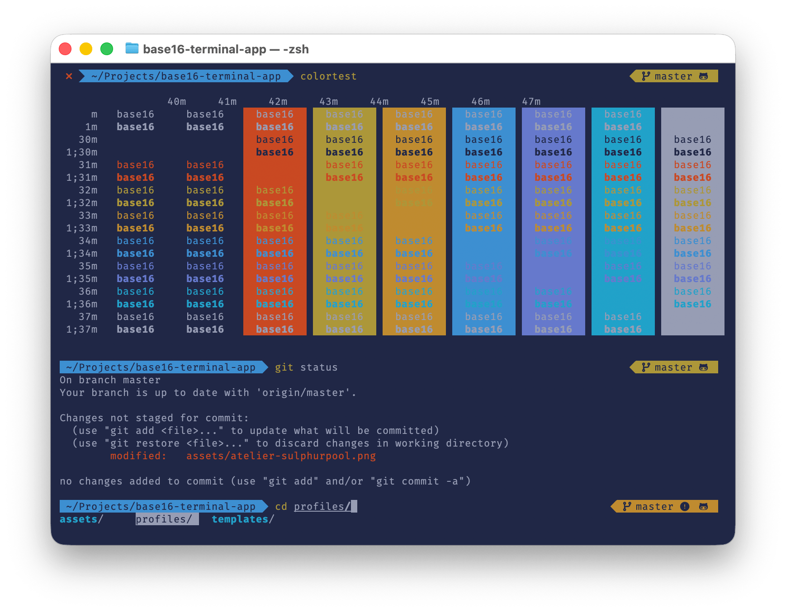

# Base16 for Terminal.app

These profiles bring the [Base16 colors](https://github.com/chriskempson/base16) to the Terminal of macOS.

## Installation

In Terminal, select *Terminal* > *Preferences*/*Settings* > *Profiles*. Then open the downloaded `profiles`
folder in the Finder and drag the files you want to install into the list of Terminal profiles.

## Customization

Since `.terminal` files contain a bunch of settings in addition to the color definitions, you
probably want these profiles to inherit all settings from a profile of your choice. (By default, my
builder extends the *Basic* profile, which is one of the default profiles provided by Apple.)

1. Download [my fork of the Base16 Builder](https://github.com/vbwx/base16-builder-php).

2. In Terminal, select *Shell* > *Export Settings* and save the file into the folder you
   just downloaded. (You can also export profiles in the *Profiles* section of the *Preferences*/*Settings*
window.)

3. Execute the following commands. (Replace &ldquo;MyProfile&rdquo; with the name of your profile.)

```sh
cd ~/Downloads/base16-builder-php-master  # the folder you downloaded in step 1
composer install  # depends on your Composer setup
php Builder.php -update
php Builder.php -p "MyProfile.terminal"
```

4. In Terminal, select *Terminal* > *Preferences*/*Settings* > *Profiles*.

5. Drag your preferred profiles into the list of installed profiles.

## Demo

\
For this screenshot, I used *Atelier Sulphurpool* with the *FiraMono Nerd Font* (11pt),
along with [Oh My Zsh](https://ohmyz.sh) (my favorite Zsh configuration framework) and the
[Powerlevel10k](https://github.com/romkatv/powerlevel10k) theme.

**Hint:** You can download
[my personally customized set of profiles](https://github.com/vbwx/base16-terminal-app/releases/download/2512/base16-terminal.dmg),
which use exactly this font and come with a few improvements over the default profiles (IMHO),
such as a blurry, transparent background for inactive windows.
