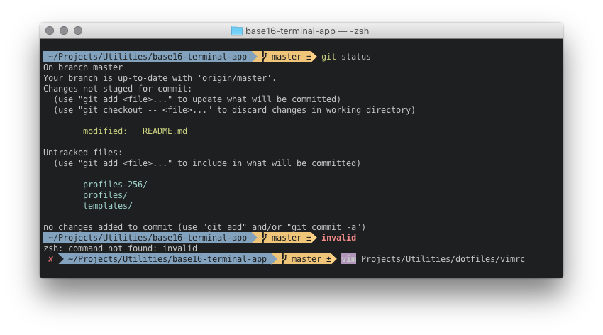

# Base16 for Terminal.app

These profiles bring the [Base16 colors](https://github.com/chriskempson/base16) to the Terminal of OS X.

## Installation

Simply double-click your preferred `.terminal` files that are located in the `profiles` folder.

If you want Terminal to preserve the basic ANSI colors (which requires additional configuration), use the files in the `profiles-256` folder.

## Customization

Since `.terminal` files contain a bunch of settings in addition to the color definitions, you probably want these profiles to inherit all settings from a profile of your choice.

1. Download my fork of the [Base16 Builder](https://github.com/vbwx/base16-builder-php).

2. In Terminal, choose *Shell > Export Settings&hellip;* and save the file to the location of the repository you just downloaded. (You can also export profiles in the *Profiles* section of the *Preferences* window.)

3. Run `php Builder.php -p MyProfile.terminal` ("MyProfile" is just a placeholder, of course.)

4. Install the profiles as explained above.

## Demo

For this screenshot, I used *Tomorrow Night* with *DejaVu Sans Mono for Powerline* (12pt) as font, along with [Prezto](https://github.com/vbwx/prezto) (my favorite Zsh configuration framework).
